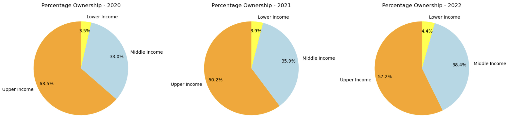

# Adoption of Electic Vehicles in California

## Presented by Group 9
* Gina Barragan
* Mo Dai
* Jim Haugen
* Aram Keledkian
* Jared Willson

## Background
The presence of Electric Vehicles (EVs) is ubiquitous in California as Californians have adopted to the use of EVs.  A recent article published on Calfornia.gov titled “California EV Sales Have Skyrocketed in the Last Decade” dated February 22, 2024 by Governor Gavin Newson, stated that “[o]ne in four news cars sold in California are zero-emission (battery, electric, plug-in hybrid or fuel cell electric).  More ZEVs were sold in California in 2023 than at any point in history[.]    

### Group 9 has challenged itself to make a presentation which answers the following questions:
* What is the adoption rate for usage of EVs between urban areas and rural areas?
* Do high-income level neighborhood have a higher adoption rate of EVs than middle-and lower-income neighborhoods?
* Has the adoption rate increased over the past three years?
* What impact, if any, has the end of Clean Vehicle Rebate Program application impacted the adoption rate of EVs?
* Has the increase in gas prices increased the adoption rate of EVs?   

## Data Resources
The following data sources have been employed in the project:
* Unites States Census Bureau;
* Graphical Information Systems Stack Exchange (Geo-Data);
* California Department of Motor Vehicle (DMV);
* California Alternative Fuels Data Center; and
* California Energy Commission.

There are two API calls contained within the notebook that will require API keys. To receive a key for collectapi.com, go to collectapi.com, choose to “sign in” using the menu option at the top of the screen. Then, create an account sign in email and password. Once created, retrieve your key by navigating to account/profile and clicking on the API token tab. This key is used for learning about gas prices over time. To receive a key for the US Census API, navigate to https://api.census.gov/data/key_signup.html and request a key. This will be provided via email. The variable names for the two keys are collect_api_key and census_api_key. These should be stored in a config.py file in the same working directory as the Jupyter notebook.  To use pip install census" and "pip install us", ensure installed Pypi census and Pypi us are installed.

### Adoption Rate for Usage of EVs between Urban Areas and Rural Areas
Firstly, Unites States Census Bureau data sets were employed from which two data frames were defined with the following parameters.
* First data frame: County, Zip Code, Year, Population, Household Income, State, and City.
* Second data frame: County, Year, Population, and Household Income.

Both data frames were made available for use by all contributors.  Th second data frame would be employed to answer this question presented.

Secondly, geographic areas comprised of area (square miles) and density were added to the second data frame so that urban and rural areas are defined by counties.

Thirdly, DMV data was merged into second data frame so that vehicles are defined as being in either a urban area or rural area.   

Fourthly, DMV data was merged into second data frame so that vehicles are defined as being in either a urban area or rural area.   

Fifthly, the second data frame was aggregated to prepare the data for a visualization.

Lastly, the following visualization was generated:

### Adoption Rates of High-Income, Middle-Income, and Lower-Income Neighborhoods 

Firstly, census data and DMV data sets were loaded for employment.

Secondly, the DMV data set was reviewed.  Upon review with visual and statistical analysis and in preparation for a subsequent merge with the census data, the data set was cleansed by dropping data deemed to be unnecessary or unusable, the format of date and zip code headers were replaced to conform to the format employed by census data, and EVs were defined by the string “Battery” appearing in the description of vehicle types.  

Thirdly, a summation of the number of EVs was performed in which the following counts were determined for years 2020 through 2022, inclusive.

Fourthly, the census data set was reviewed.  Upon review with visual and statistical analysis, years 2020-2022 were located, the zip code header were renamed to match those in the DMV data, unnecessary data was dropped, and county headers were renamed to match the DMV data.  Then, census data was merged with DMV data.

Fifthly, upper- and lower-income level boundaries were established as a function of 25% and 75% quartiles as applied to household income in 2020-2022.  The middle-income level is defined as those values appearing between the upper- and lower-income levels. 

Sixthly, an analysis of the data after the merge of the DMV data with the census data resulted in non-number data.  This data was dropped.

Seventhly, vehicle counts per zip codes, counties, and state were generated as a function of the upper-, middle- and lower-income levels.    ; zip codes were used to define neighborhoods.

Lastly, the following visualizations were generated:       

### EV’s by County & Fuel Type Comparison

An analysis of fuel types for DMV registrations by county showed there was an increase in the number of registered Battery Electric Vehicles in California from 2020 through 2022. Compared to other fuel types, the rise in Battery Electric vehicles (EVs) across California did not signify a decline in other fuel types. Instead, the increase in EV adoption varied significantly among counties, with major cities like Alameda, Los Angeles, Orange County, San Diego, and Santa Clara leading the charge. Notably, Santa Clara saw a remarkable surge from 4% in 2021 to 16% in 2022, while Los Angeles doubled its adoption rate from 11% to 22% during the same period.

### Exploring the remarkable growth of Electric Vehicle (EV) charging stations in California counties, deciphering what these numbers signify for the state's transportation landscape.

* Unprecedented Expansion: The data showcases an unprecedented surge in EV charging station deployment across California's diverse counties. This surge signifies a concerted effort to bolster EV infrastructure, catering to the escalating demand for electric vehicles statewide.
* Interpreting County Trends: By analyzing county-specific data, we uncover varying growth rates in charging station deployment. Densely populated counties such as Los Angeles, Orange, and Santa Clara exhibit particularly significant increases, indicating a heightened embrace of electric mobility in urban centers.
* Addressing Urban Mobility Demands: The pronounced growth in charging stations within densely populated counties is pivotal in meeting the burgeoning demands of urban mobility. As more residents embrace electric vehicles, accessible charging infrastructure becomes essential for seamless travel experiences in city environments.
* Catalyzing Sustainable Transportation: The expansion of EV charging stations in populous counties not only facilitates urban mobility but also accelerates the transition towards sustainable transportation. By incentivizing EV adoption in urban hubs, we mitigate environmental impact, reduce congestion, and pave the way for cleaner, healthier communities.

In conclusion, the surge in EV charging stations across California counties signifies a significant shift towards sustainable transportation. As densely populated areas lead the charge in EV adoption, the proliferation of charging infrastructure becomes pivotal for shaping a cleaner, greener future. By understanding these trends and prioritizing investments in EV infrastructure, we can expedite the transition towards a more sustainable transportation ecosystem statewide.

